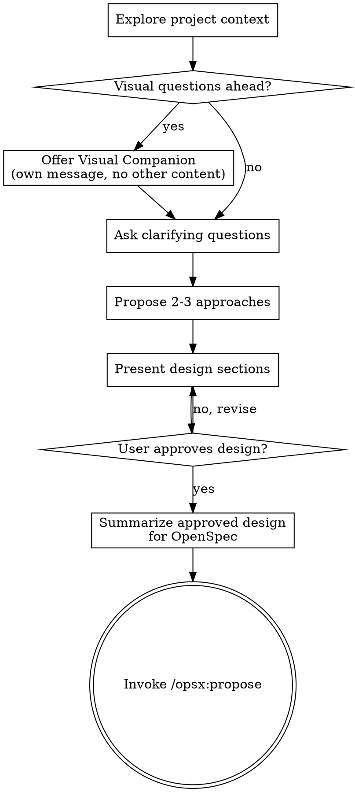

# Brainstorming Ideas Into Designs

Help turn rough ideas into decisions that are ready for OpenSpec.

Use this skill for unclear or exploratory requests. If the user already has a clear change request or explicitly invokes an `/opsx:*` stage, follow the repository's OpenSpec workflow instead of forcing a separate brainstorming pass.

Start by understanding the current project context, then ask questions one at a time to refine the idea. Once you understand what should be built, present the design and get user approval. Do not create a parallel spec or plan outside OpenSpec.

<HARD-GATE>
Do NOT invoke any implementation skill, write any code, scaffold any project, or take any implementation action until you have presented a design and the user has approved it.
</HARD-GATE>

## Anti-Pattern: "This Is Too Simple To Need A Design"

If you are using this skill, do not wave away design just because the request seems small. "Simple" changes are where unexamined assumptions cause the most wasted work. The design can be short, but you MUST present it and get approval before handing off to OpenSpec.

## Checklist

You MUST create a task for each of these items and complete them in order:

1. **Explore project context** - check files, docs, recent commits
2. **Offer visual companion** (if topic will involve visual questions) - this is its own message, not combined with a clarifying question. See the Visual Companion section below.
3. **Ask clarifying questions** - one at a time, understand purpose/constraints/success criteria
4. **Propose 2-3 approaches** - with trade-offs and your recommendation
5. **Present design** - in sections scaled to their complexity, get user approval after each section
6. **Summarize approved design for OpenSpec** - produce concise handoff notes covering scope, constraints, approach, risks, and testing expectations
7. **Continue with OpenSpec** - invoke `/opsx:propose`

## How To Trigger It

Ask for `brainstorming` explicitly when you want help shaping an idea before writing the OpenSpec change.

Examples:
- `Use brainstorming to help me figure out a robust model preload validation feature before we write the OpenSpec proposal.`
- `Let's brainstorm options for improving realtime demo startup safety. I want to compare approaches first.`
- `I have a rough feature idea but not a clean change boundary yet. Use brainstorming first.`

Once the idea is clear and approved, the next step is to run `/opsx:propose ...`, not to keep chatting indefinitely and not to write a separate spec file.

## Process Flow

**The terminal state is invoking `/opsx:propose`.** Do NOT create `docs/...` spec or plan files. OpenSpec is the only source of truth after brainstorming.

## The Process

**Understanding the idea:**

- Check out the current project state first (files, docs, recent commits)
- Before asking detailed questions, assess scope: if the request describes multiple independent subsystems, flag this immediately. Don't spend questions refining details of a project that needs to be decomposed first.
- If the project is too large for a single OpenSpec change, help the user decompose into smaller changes. Each change should remain understandable, reviewable, and independently shippable.
- For appropriately-scoped projects, ask questions one at a time to refine the idea
- Prefer multiple choice questions when possible, but open-ended is fine too
- Only one question per message - if a topic needs more exploration, break it into multiple questions
- Focus on understanding: purpose, constraints, success criteria

**Exploring approaches:**

- Propose 2-3 different approaches with trade-offs
- Present options conversationally with your recommendation and reasoning
- Lead with your recommended option and explain why

**Presenting the design:**

- Once you believe you understand what you're building, present the design
- Scale each section to its complexity: a few sentences if straightforward, up to 200-300 words if nuanced
- Ask after each section whether it looks right so far
- Cover: architecture, components, data flow, error handling, testing
- Be ready to go back and clarify if something doesn't make sense

**Design for isolation and clarity:**

- Break the system into smaller units that each have one clear purpose, communicate through well-defined interfaces, and can be understood and tested independently
- For each unit, you should be able to answer: what does it do, how do you use it, and what does it depend on?
- Can someone understand what a unit does without reading its internals? Can you change the internals without breaking consumers? If not, the boundaries need work.
- Smaller, well-bounded units are also easier for you to work with - you reason better about code you can hold in context at once, and your edits are more reliable when files are focused. When a file grows large, that's often a signal that it's doing too much.

**Working in existing codebases:**

- Explore the current structure before proposing changes. Follow existing patterns.
- Where existing code has problems that affect the work, include targeted improvements as part of the design.
- Don't propose unrelated refactoring. Stay focused on what serves the current goal.

## After the Design

**OpenSpec handoff:**

- Summarize the approved design in a concise form that can seed OpenSpec:
  - Problem statement
  - Goals and non-goals
  - Recommended approach
  - Key constraints and risks
  - Testing expectations
- Do not save a parallel spec, design doc, or plan under `docs/`
- Continue with `/opsx:propose`

**Implementation:**

- Once OpenSpec artifacts exist, follow OpenSpec's lifecycle for implementation and archival
- Use repository skills only to improve execution quality around that lifecycle

## Key Principles

- **One question at a time** - Don't overwhelm with multiple questions
- **Multiple choice preferred** - Easier to answer than open-ended when possible
- **YAGNI ruthlessly** - Remove unnecessary features from all designs
- **Explore alternatives** - Always propose 2-3 approaches before settling
- **Incremental validation** - Present design, get approval before moving on
- **Be flexible** - Go back and clarify when something doesn't make sense

## Visual Companion

A browser-based companion for showing mockups, diagrams, and visual options during brainstorming. Available as a tool — not a mode. Accepting the companion means it's available for questions that benefit from visual treatment; it does NOT mean every question goes through the browser.

**Offering the companion:** When you anticipate that upcoming questions will involve visual content (mockups, layouts, diagrams), offer it once for consent:
> "Some of what we're working on might be easier to explain if I can show it to you in a web browser. I can put together mockups, diagrams, comparisons, and other visuals as we go. This feature is still new and can be token-intensive. Want to try it? (Requires opening a local URL)"

**This offer MUST be its own message.** Do not combine it with clarifying questions, context summaries, or any other content. The message should contain ONLY the offer above and nothing else. Wait for the user's response before continuing. If they decline, proceed with text-only brainstorming.

**Per-question decision:** Even after the user accepts, decide FOR EACH QUESTION whether to use the browser or the terminal. The test: **would the user understand this better by seeing it than reading it?**

- **Use the browser** for content that IS visual — mockups, wireframes, layout comparisons, architecture diagrams, side-by-side visual designs
- **Use the terminal** for content that is text — requirements questions, conceptual choices, tradeoff lists, A/B/C/D text options, scope decisions

A question about a UI topic is not automatically a visual question. "What does personality mean in this context?" is a conceptual question — use the terminal. "Which wizard layout works better?" is a visual question — use the browser.

If they agree to the companion, read the detailed guide before proceeding:
`skills/brainstorming/visual-companion.md`
